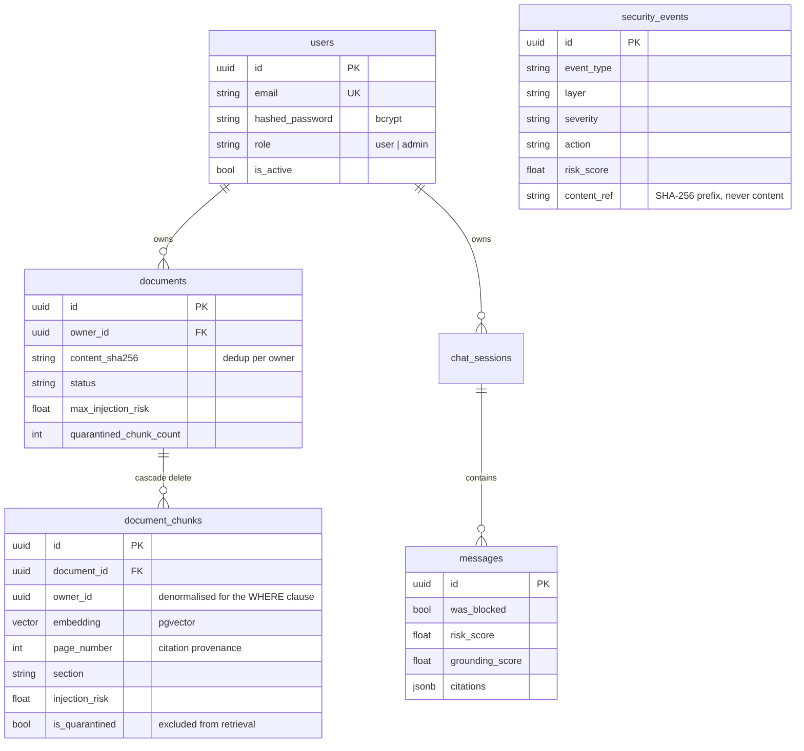

# Architecture

This document explains **why** SecureRAG is built the way it is. Every section
answers a design question and records the trade-off, because a decision without
its alternative is not a decision — it is a default.

---

## 1. The shape of the system

```mermaid
flowchart TB
    U([User]) --> FE[React frontend]
    FE -->|HTTPS + JWT| API[FastAPI edge]

    subgraph EDGE [" "]
        API --> MW["Request context<br/>id · timing · security headers"]
        MW --> AUTH{"Authenticated?<br/>role re-read from DB"}
    end

    AUTH -->|no| R401([401])
    AUTH -->|yes| RL{"Rate limit<br/>sliding window"}
    RL -->|exceeded| R429([429 + Retry-After])

    RL --> IG
    subgraph IG ["INPUT GUARDRAIL"]
        V["Normalise + validate<br/>NFKC · strip zero-width · length"]
        V --> L1["Layer 1 · signatures"]
        L1 --> L2["Layer 2 · heuristics"]
        L2 --> L3["Layer 3 · LLM classifier<br/><i>optional, borderline only</i>"]
        L3 --> SCORE["noisy-OR + benign damping"]
    end

    SCORE -->|"risk ≥ block"| BLOCK([Blocked · no model call])
    SCORE -->|allow / flag| RAG

    subgraph RAG ["RETRIEVAL"]
        SCOPE["AccessScope<br/><b>owner_id in SQL</b>"]
        SCOPE --> VEC["Vector arm<br/>pgvector HNSW"]
        SCOPE --> KW["Keyword arm<br/>tsvector / BM25"]
        VEC --> RRF["Reciprocal Rank Fusion"]
        KW --> RRF
        RRF --> RANK["Rerank → top-k"]
    end

    RANK --> CTX
    subgraph CTX ["CONTEXT SECURITY"]
        Q["Quarantined chunks<br/>excluded by WHERE clause"]
        Q --> SAN["Sanitise: drop / neutralise<br/>sentence-level"]
        SAN --> FENCE["Nonce-fenced prompt<br/>system | data | question"]
    end

    FENCE --> LLM[["LLM<br/>OpenAI-compatible · Ollama · echo"]]

    LLM --> OG
    subgraph OG ["OUTPUT GUARDRAIL"]
        S1["1 · Schema validation"]
        S1 --> S2["2 · Citation resolution<br/>index → document"]
        S2 --> S3["3 · Safety<br/>prompt leak · exfiltration"]
        S3 --> S4["4 · Grounding<br/>claim-level support"]
        S4 --> S5["5 · PII<br/>regex + checksum"]
    end

    OG -->|fails| REFUSE([Refusal · answer withheld])
    OG -->|passes| ANSWER([Answer + verified sources])

    BLOCK -.-> AUDIT[(security_events)]
    REFUSE -.-> AUDIT
    ANSWER -.-> AUDIT
    Q -.-> AUDIT
    AUDIT --> DASH[Dashboard + Playground]

    style IG fill:#1a1f2b,stroke:#e05252
    style CTX fill:#1a1f2b,stroke:#d99a2b
    style OG fill:#1a1f2b,stroke:#5b8def
    style RAG fill:#1a1f2b,stroke:#2ea56b
```



The single most important structural property: **there is exactly one path from
a request to an answer**, and it is [`app/rag/pipeline.py`](../backend/app/rag/pipeline.py).
The service layer cannot reach the generator directly, so no guardrail can be
skipped by adding a new caller.

---

## 2. Why PostgreSQL + pgvector?

**The question:** why not Pinecone, Weaviate, Qdrant, or Chroma?

**The answer: because the authorisation predicate and the similarity search
have to be the same query.**

This is the decisive argument, and it is a *security* argument rather than an
operational one. With a separate vector database you get:

```python
hits = vector_db.search(query_vector, top_k=5)          # no idea who owns what
allowed = [h for h in hits if h.owner_id == user.id]    # post-filter
```

That code has two defects. It leaks the *existence* of other users' matching
documents through timing and result counts, and — worse — it silently returns
fewer than `k` results, so a user's own answer degrades because someone else's
document outranked it. Filtering after ranking is always wrong.

With pgvector the predicate and the ranking are one statement:

```sql
SELECT *, embedding <=> :query AS distance
FROM document_chunks
WHERE owner_id = :user_id          -- authorisation
  AND is_quarantined = false       -- context security
ORDER BY distance
LIMIT :k;
```

The database never materialises a row the caller may not see. Secondary
benefits: one datastore to operate and back up, transactional consistency
between a document's metadata and its vectors (no orphaned embeddings when an
ingest fails halfway), and joins to `documents` for metadata filtering.

**The cost, stated honestly:** pgvector is slower than a dedicated ANN engine at
very large scale (tens of millions of vectors), and it lacks features like
built-in multi-tenancy namespaces. At the scale this project targets, and given
the authorisation argument, that trade is clearly worth taking.

**Index choice — HNSW over IVFFlat.** IVFFlat needs a training pass over
representative data and degrades as the distribution shifts; HNSW needs no
training and stays accurate under incremental inserts, which is exactly the
upload-driven write pattern here.

### The SQLite fallback

The vector column is a dialect-aware `TypeDecorator`
([`app/db/types.py`](../backend/app/db/types.py)): a real `vector(n)` on
PostgreSQL, a JSON array elsewhere. `get_vector_store()` picks the matching
backend at runtime.

This exists so the repository can be cloned and its tests run with **no
infrastructure at all**. The fallback computes cosine similarity in Python —
correct, but O(n) per query. It is for tests and demos, never for a real corpus,
and `/health/ready` reports which backend is live so the difference is never
invisible.

---

## 3. Why chunk, and why *this* chunking?

Chunking exists because of two hard constraints: context windows are finite, and
embedding quality collapses as text gets longer — one vector cannot faithfully
represent a document covering five unrelated topics.

Fixed-length splitting (`text[i:i+1000]`) is the tutorial default and is
actively harmful:

- it splits mid-sentence, so a chunk can assert the *opposite* of its source —
  `"Employees are not entitled to"` | `"carry leave forward"`;
- it merges unrelated sections, diluting both embeddings;
- it destroys the page and heading provenance a citation needs.

The strategy implemented in
[`app/rag/ingestion/chunker.py`](../backend/app/rag/ingestion/chunker.py):

| Step | Rule | Why |
|---|---|---|
| 1 | Group by section + page | A chunk never spans two topics |
| 2 | Pack whole paragraphs to a token budget | Preserves natural units |
| 3 | Over-long paragraph → split on sentences | Never mid-sentence |
| 4 | Over-long sentence → split on words | Never mid-word |
| 5 | Overlap by whole *sentences* | A fact on a boundary is findable from either side, and both copies are readable |
| 6 | Absorb fragments below `CHUNK_MIN_CHARS` | A 40-character chunk is index noise |

**Why sentence-level overlap rather than character overlap?** Character overlap
produces `"...ployees accrue two days of pa"` at the head of the next chunk —
text that embeds badly and reads as corruption if it ever appears in a citation.

**Why no tiktoken?** A real BPE tokenizer downloads its vocabulary on first use,
which would make ingestion require network access and the test suite
non-hermetic. `estimate_tokens()` blends a word-count and character-count
estimate, accurate to roughly ±15% on English prose. The chunk budget is a soft
target, so the extra precision buys nothing — and swapping in a real tokenizer
means replacing one function.

---

## 4. Why hybrid retrieval?

Dense and sparse retrieval fail on opposite inputs, and the failures are not
correlated:

| Query | Vector search | Keyword search |
|---|---|---|
| "time off entitlement" | finds "annual leave policy" | misses (no shared terms) |
| "clause 7.3.2" | returns something *about* clauses | exact hit |
| "form 16A" | returns tax-form prose | exact hit |
| "what happens if I resign" | finds "termination" section | misses |

Enterprise documents are full of identifiers, codes, dates and rare proper
nouns — precisely where embeddings are weakest. Fusing both arms is strictly
better than either.

### Why Reciprocal Rank Fusion rather than a weighted score sum?

The arms return incomparable quantities: cosine similarities in `[-1, 1]`, and
BM25 or `ts_rank_cd` values on an unbounded scale. Combining them by weighted
sum requires calibration that breaks the moment the embedding model changes.

RRF discards the scores and fuses on **rank**:

$$\text{score}(d) = \sum_{\text{arms}} \frac{1}{k + \text{rank}_{\text{arm}}(d)}$$

It is scale-free, robust to one arm being badly calibrated, and rewards
documents both arms surface — exactly the signal we want. One parameter,
`k = 60`, from Cormack et al. (SIGIR 2009).

### Why rerank at all?

Retrieval optimises **recall** over a large corpus; reranking optimises
**precision** over the ~20 survivors. In a security-first system this matters
more than usual: every chunk placed in the context is another chunk that could
carry an embedded instruction. A tighter top-k is a smaller attack surface, not
just a cheaper prompt.

The default `HeuristicReranker` combines retrieval score, query-term coverage,
exact-phrase presence, a length prior and an **injection-risk penalty**. It is
deterministic, costs microseconds, and is fully explainable in the UI — a
reviewer can read exactly why a chunk ranked where it did. A cross-encoder
(`RERANKER=cross_encoder`) orders better but pulls in ~2 GB of torch, so it is
opt-in.

---

## 5. Why metadata filtering matters

`AccessScope` is a **required** argument to every search function. There is no
overload that omits it, so an unscoped query cannot be written by accident.

`apply_access_scope()` is the single choke point every retrieval path routes
through — vector, keyword, and direct fetch. One place to get the ownership rule
wrong, and one place to audit.

The `document_chunks.owner_id` column is **denormalised** from
`documents.owner_id`. That is deliberate: it lets the ownership predicate sit in
the same `WHERE` clause as the ANN search, so the index and the authorisation
are evaluated together. A join would either defeat the index or tempt someone
into post-filtering.

---

## 6. Why ingestion is synchronous

Ingestion runs inside the request. A queue (Celery/RQ + Redis) is the right
answer for large files, and this is a real limitation for a 200-page PDF.

It is not used here because it would add a broker, a worker process and a
result backend — roughly doubling the operational surface — to solve a problem
that does not exist at portfolio scale. The trade is recorded rather than
hidden, and the change is contained: `DocumentService.ingest_upload` already
separates *validate → parse → chunk → scan → embed → persist*, so moving the
tail into a task means enqueuing after the document row is created and having
the worker call the same `IngestionPipeline`.

---

## 7. Why the LLM provider is an interface

[`app/rag/llm/`](../backend/app/rag/llm/) defines `LLMProvider` with three
implementations: OpenAI-compatible, Ollama, and `echo`.

**Why OpenAI-*compatible* rather than the OpenAI SDK?** The `/chat/completions`
shape is a de-facto standard — Groq, Together, OpenRouter, vLLM, LM Studio and
llama.cpp all speak it. One implementation, many deployment options, no vendor
lock-in, and no cost floor for someone evaluating the project.

**Why `echo` exists** is covered in [evaluation.md](evaluation.md); the short
version is that a sampling model makes a test suite flaky for reasons unrelated
to the code, and the repository must be runnable without an API key. The
application **refuses to boot** with `ENVIRONMENT=production` and
`LLM_PROVIDER=echo`, so the stand-in cannot quietly end up serving real users.

---

## 8. Data model



**Why UUID primary keys?** Document and user ids appear in API paths.
Sequential integers leak corpus size and invite enumeration (`/documents/1`,
`/documents/2`, …). Authorisation is still enforced server-side — unguessable
ids are defence in depth, not the control.

**Why `security_events` stores no content.** It records *decisions and
metadata*. Query and document text are represented by a short SHA-256 prefix,
which is enough to recognise the same payload arriving fifty times (an attack
campaign) without the payload itself becoming a second copy of the data you
were protecting. `record_event()` actively drops forbidden keys from `detail`
even if a caller passes them by mistake.

**Why migrations, not `create_all()`.** `Base.metadata.create_all()` cannot
express an index type, cannot enable an extension, and — critically — has no
upgrade path. Migration `0001` enables `vector`, creates the HNSW index with
explicit `m`/`ef_construction`, and builds a functional GIN index over
`to_tsvector('english', content)`. None of that is expressible in the ORM. The
test suite runs the real migrations, so a broken migration fails the build
rather than diverging silently from production.

---

## 9. Request lifecycle and observability

Every request gets a `request_id` at the edge, carried through every layer via
`contextvars` rather than threaded through fifteen signatures. It appears in
every log line, every security event, the `X-Request-ID` response header, and
the stored message row — so one request's full decision trail is one grep.

Stage latencies are recorded individually (`input_guard_ms`, `embed_ms`,
`vector_ms`, `keyword_ms`, `rerank_ms`, `sanitise_ms`, `llm_ms`,
`output_guard_ms`) and returned in the API response. This makes the cost
structure visible: the guardrails are single-digit milliseconds against an LLM
call measured in hundreds, which is the empirical answer to "isn't all this
checking expensive?".

**Cost discipline.** The expensive stage runs last. A blocked query costs
**zero** model calls, and an empty retrieval costs zero model calls. The
optional LLM classifier is consulted only for inputs the cheap layers scored as
*borderline*, never on every request.

---

## 10. Known architectural limitations

Stated here rather than discovered later:

1. **Rate limiting is in-process.** With N workers the effective limit is
   N × limit, and a restart clears the counters. The fix is a Redis-backed
   store behind the existing `RateLimiter` interface.
2. **Ingestion blocks the request.** See §6.
3. **The SQLite fallback is O(n) per query.** Fine for tests, wrong for a real
   corpus.
4. **No conversational memory in retrieval.** Each question is retrieved
   independently; follow-ups like "what about part-time staff?" lose the
   subject. Query rewriting from conversation history is the standard fix and
   is not implemented.
5. **No streaming.** Answers are validated *then* returned, which is inherent
   to output guardrails: you cannot verify grounding on a token you have not
   generated yet. Streaming would require either optimistic streaming with
   retraction, or validating in windows — both materially more complex.
6. **Single-tenant model.** `DocumentVisibility.ORGANISATION` exists as an
   extension point but behaves as owner-only today.
